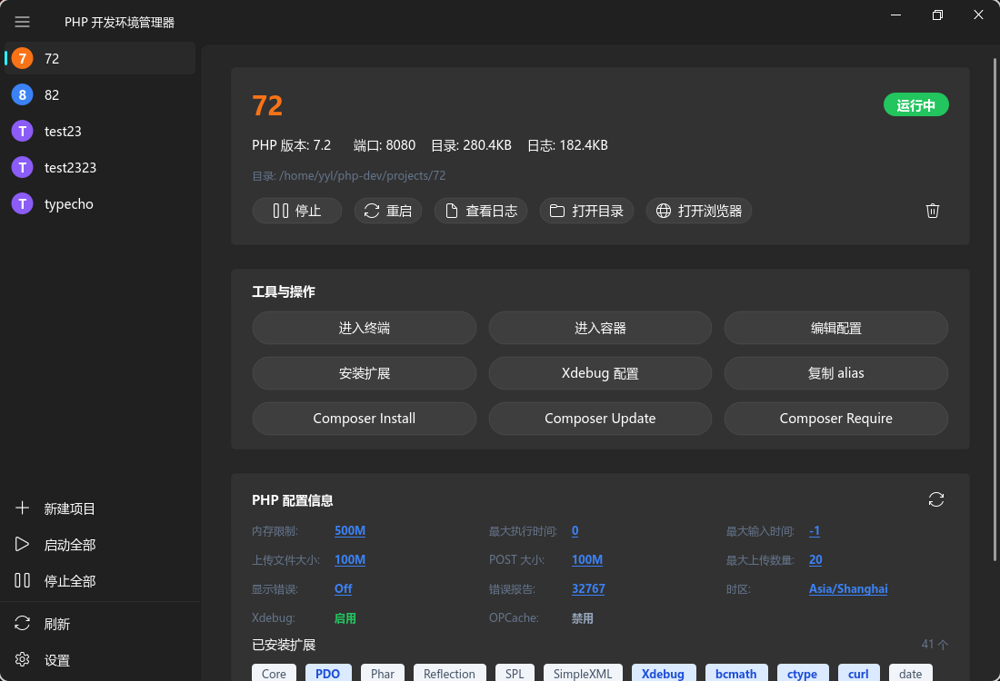

# phpbox

PHP Docker 开发环境管理器 —— 图形化管理 PHP 容器环境




## 特性

- PHP **7.2 - 8.4** 多版本支持
- **60+** PHP 扩展，按分类选择
- Docker 容器启停、日志查看、命令执行
- Xdebug 一键配置
- 现代化 UI，浅色/深色主题
- 系统托盘常驻

## 安装

```bash
# 克隆仓库
git clone https://github.com/yourusername/phpbox.git
cd phpbox

# 安装依赖
python -m venv .venv
source .venv/bin/activate
pip install -r requirements.txt

# 运行
python main.py
```

## 使用

1. 点击 **新建项目**，输入项目名称
2. 选择 PHP 版本和端口
3. 勾选需要的 PHP 扩展
4. 点击创建，自动生成 Docker 配置并启动容器

## 构建

```bash
./build.sh --bin        # 二进制
./build.sh --appimage   # AppImage
./build.sh --deb        # deb 包
```

## 技术栈

| 技术 | 版本 |
|------|------|
| PyQt6 | >= 6.5.0 |
| PyQt6-Fluent-Widgets | >= 1.4.0 |
| Docker & Docker Compose | - |

## 许可证

MIT License
